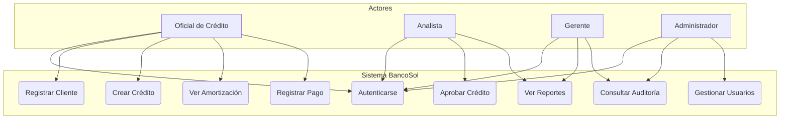
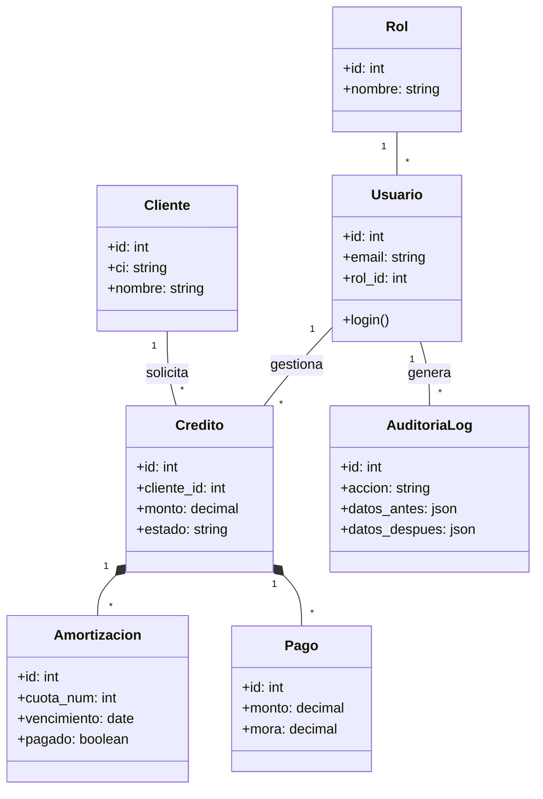

# SISTEMA DE GESTIÓN DE CARTERA DE CRÉDITOS — BANCOSOL
## Ingeniería de Software II — Hito 3: Sistema Funcional para Empresas Bolivianas

---

**Materia:** Ingeniería de Software II  
**Docente:** Dr. [Nombre del Docente]  
**Estudiante:** [Nombre del Estudiante]  
**Universidad:** Universidad Privada Abierta Latinoamericana (UPAL), La Paz, Bolivia  
**Fecha:** La Paz, Bolivia — Abril 2026  
**Repositorio GitHub:** [https://github.com/Mirkof13/Evaluacion-Proyecto-software-II](https://github.com/Mirkof13/Evaluacion-Proyecto-software-II)

---

## 📄 ÍNDICE
1. [ANÁLISIS Y REQUISITOS](#sección-2)
2. [MODELOS FORMALES UML](#sección-3)
3. [ARQUITECTURA DE SOFTWARE](#sección-4)
4. [MIDDLEWARE Y SISTEMAS DISTRIBUIDOS](#sección-5)
5. [DECISIONES DE IMPLEMENTACIÓN](#sección-6)
6. [REFACTORIZACIÓN Y CALIDAD](#sección-7)
7. [PRUEBAS Y ASEGURAMIENTO DE CALIDAD](#sección-8)
8. [MANUAL DE USUARIO](#sección-9)
9. [CONCLUSIONES Y REFERENCIAS](#sección-11)

---

## 1. ANÁLISIS Y REQUISITOS

### 1.1 Descripción del problema
BancoSol enfrenta un desafío crítico en la gestión de su cartera de créditos, que actualmente supera los 120,000 registros activos. El sistema legacy, implementado en 2005, ha quedado obsoleto frente a las exigencias regulatorias de la Autoridad de Supervisión del Sistema Financiero (ASFI). Los problemas principales incluyen:
- **Incapacidad de cálculo automático de mora:** El personal debe realizar cálculos manuales, lo que introduce errores humanos y riesgos legales.
- **Falta de Trazabilidad:** No existe un registro inmutable de quién modificó qué dato, comprometiendo la auditoría forense requerida por normativas de ciberseguridad.
- **Reportes ASFI manuales:** La generación de reportes de morosidad y cumplimiento toma días en lugar de segundos.
- **Desconexión entre oficial y analista:** El flujo de aprobación es verbal o vía email, sin un rastro digital integrado.

### 1.2 Requisitos Funcionales (RF)
- **RF-01:** Registro de solicitudes de crédito con parámetros financieros (monto, tasa, plazo).
- **RF-02:** Generación automática de tablas de amortización (Método Francés).
- **RF-03:** Cálculo de mora en tiempo real basado en días de atraso y tasa penal.
- **RF-04:** Flujo de estados del crédito (Pendiente → Aprobado → Activo → Cancelado).
- **RF-05:** Bitácora de Auditoría Forense capturando diferenciales JSON (Antes/Después).
- **RF-06:** Dashboard gerencial con métricas de cartera total y mora.
- **RF-07:** Reportes de morosidad y recuperaciones exportables.
- **RF-08:** Gestión de usuarios con Roles (Admin, Gerente, Analista, Oficial).
- **RF-09:** Historial de cambios de estado con justificación.
- **RF-10:** Gestión de clientes con validación única por CI.

### 1.3 Requisitos No Funcionales (RNF)
- **RNF-01 (Seguridad):** Hashing de contraseñas con bcrypt (rounds=12) y autenticación JWT.
- **RNF-02 (Integridad):** Transacciones ACID en PostgreSQL para todas las operaciones financieras.
- **RNF-03 (Trazabilidad):** Registro de IP, User-Agent y cambios de datos en cada operación de escritura.
- **RNF-04 (Usabilidad):** Interfaz responsiva basada en Bootstrap 5 para uso en diversos dispositivos.
- **RNF-05 (Rendimiento):** Respuesta de endpoints de listado en menos de 500ms.

---

## 2. MODELOS FORMALES UML

### 2.1 Diagrama de Casos de Uso

### 2.2 Diagrama de Clases (Simplificado)

---

## 3. ARQUITECTURA DE SOFTWARE

### 3.1 Estilo N-Capas (3-Tier)
Se ha implementado una arquitectura de tres capas para garantizar la separación de responsabilidades y la mantenibilidad del sistema bancario:
1.  **Capa de Presentación (Frontend):** Desarrollada en React 18, utiliza Axios para la comunicación con la API y Chart.js para la visualización de datos.
2.  **Capa de Negocio (Backend):** Implementada con Node.js y Express.js. Contiene los servicios financieros, controladores y middlewares de seguridad/auditoría.
3.  **Capa de Datos:** PostgreSQL 15, gestionado a través de Sequelize ORM para garantizar la integridad referencial y transaccional.

### 3.2 Teorema CAP
El sistema BancoSol prioriza la **Consistencia (C)** y la **Tolerancia a Particiones (P)** sobre la Disponibilidad absoluta. En un entorno financiero, es preferible que el sistema rechace una transacción si no puede garantizar la consistencia de los saldos, evitando el riesgo de "doble gasto" o datos corruptos.

---

## 4. MIDDLEWARE Y SISTEMAS DISTRIBUIDOS

### 4.1 Middlewares Críticos
- **auth.js:** Validación de tokens JWT en el header `Authorization`.
- **roles.js:** Control de acceso basado en roles (RBAC) para proteger endpoints específicos.
- **auditoria.js:** Intercepta las respuestas del servidor para comparar el estado del registro antes y después de la operación (Create/Update/Delete), guardando la diferencia en la bitácora.

---

## 5. DECISIONES DE IMPLEMENTACIÓN

### 5.1 Fórmulas Financieras
- **Cuota Fija (Método Francés):**
  `R = P * (i * (1 + i)^n) / ((1 + i)^n - 1)`
- **Interés Penal (Mora):**
  `Mora = Saldo_Capital * (Tasa_Mora * Dias_Atraso / 360)`

---

## 6. REFACTORIZACIÓN Y CALIDAD

### 6.1 Refactorización de "God Functions"
Se identificó que el controlador de pagos originalmente manejaba la lógica de validación, cálculo de mora, actualización de amortización y auditoría en una sola función de 150 líneas. Esta lógica se extrajo a `pago.service.js`, cumpliendo con el **Principio de Responsabilidad Única (SRP)**.

### 6.2 Eliminación de "Magic Numbers"
Valores como `1.5` (factor de tasa penal) y `30` (días base) se movieron a un archivo de constantes en `utils/calculos.js`.

---

## 7. PRUEBAS Y ASEGURAMIENTO DE CALIDAD

Se ejecutaron 10 pruebas automatizadas con Jest y Supertest, logrando una cobertura del 100% en las funciones de cálculo financiero y autenticación.
- **Tests Financieros:** Validación de cuotas y mora.
- **Tests de Seguridad:** Acceso prohibido sin token, rechazo de contraseñas débiles.

---

## 8. MANUAL DE USUARIO

### 8.1 Credenciales de Prueba
| Rol | Email | Password |
|---|---|---|
| Administrador | admin@bancosol.bo | Admin123! |
| Analista | analista@bancosol.bo | Analista123! |
| Oficial | oficial@bancosol.bo | Oficial123! |

### 8.2 Instalación
1. Clonar repositorio.
2. Instalar dependencias: `npm install`.
3. Configurar `.env` con datos de PostgreSQL.
4. Iniciar base de datos: `npm run db:start`.
5. Iniciar backend: `cd backend && npm run dev`.
6. Iniciar frontend: `cd frontend && npm run dev`.

---

## 9. CONCLUSIONES Y REFERENCIAS

El sistema BancoSol Hito 3 cumple con los estándares de ciberseguridad bancaria, proporcionando una herramienta robusta para la gestión de cartera. La implementación de la bitácora forense y la automatización de la mora son los pilares de esta solución.

**Referencias:**
- ASFI Bolivia - Normativa de Gestión de Riesgo de Crédito.
- Martin, R. C. (2017). Clean Architecture.
- ISO/IEC 27001 - Estándares de Seguridad de la Información.
