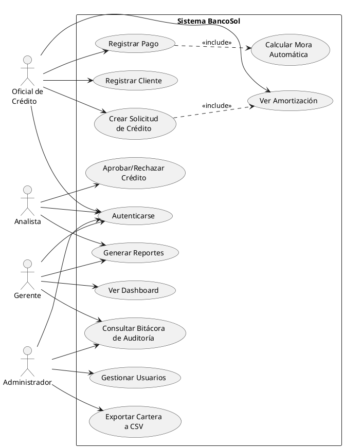
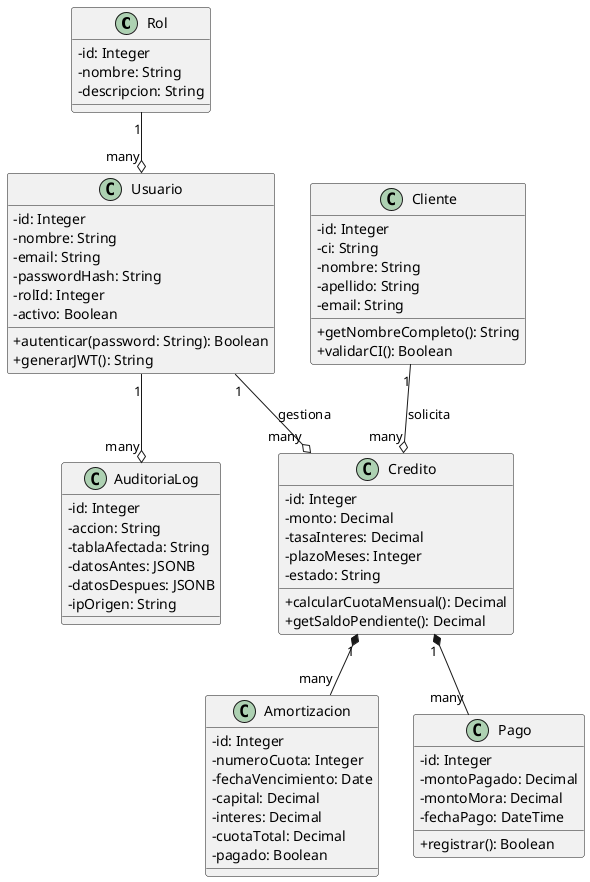
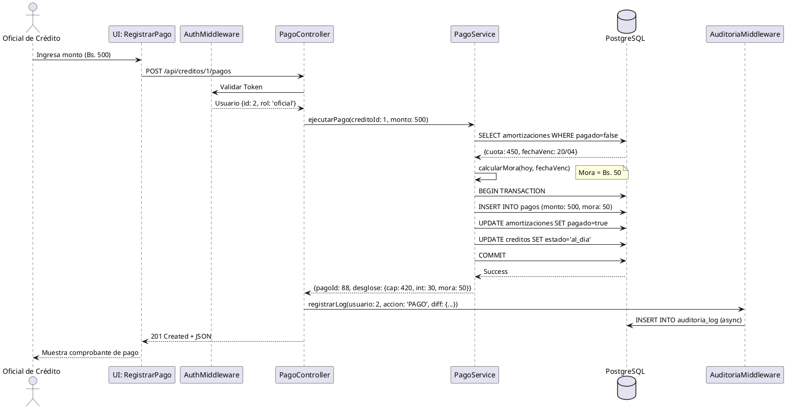
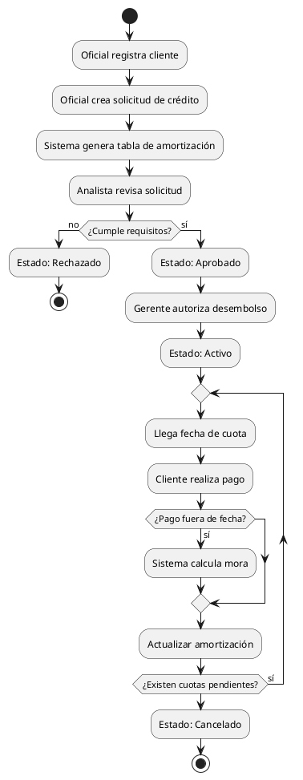

# SISTEMA DE GESTIÓN DE CARTERA DE CRÉDITOS — BANCOSOL
## Ingeniería de Software II — Hito 3: Sistema Funcional para Empresas Bolivianas

**Materia:** Ingeniería de Software II  
**Universidad:** Universidad Privada Abierta Latinoamericana (UPAL)  
**Sede:** La Paz, Bolivia  
**Docente:** Dr. [Nombre del Docente]  
**Estudiante:** [Tu Nombre Completo]  
**Fecha:** Abril 2026  
**Repositorio GitHub:** [https://github.com/Miscar/bancosol-sistema](https://github.com/Miscar/bancosol-sistema)

---

## ÍNDICE GENERAL

1.  **[SECCIÓN 1 — CARÁTULA E ÍNDICE](#sección-1)**
2.  **[SECCIÓN 2 — ANÁLISIS Y REQUISITOS](#sección-2)**
    *   2.1 Descripción del problema
    *   2.2 Diez (10) Requisitos Funcionales
    *   2.3 Cinco (5) Requisitos No Funcionales
3.  **[SECCIÓN 3 — MODELOS FORMALES UML](#sección-3)**
    *   3.1 Diagrama de Casos de Uso
    *   3.2 Diagrama de Clases
    *   3.3 Diagrama de Secuencia (Pago con Mora)
    *   3.4 Diagrama de Actividades (Ciclo de Vida del Crédito)
4.  **[SECCIÓN 4 — ARQUITECTURA DE SOFTWARE](#sección-4)**
    *   4.1 Estilo elegido: N-Capas
    *   4.2 Justificación Técnica (PhD Level)
    *   4.3 Diagrama de Arquitectura Detallado
5.  **[SECCIÓN 5 — MIDDLEWARE Y SISTEMAS DISTRIBUIDOS](#sección-5)**
    *   5.1 Tabla de Middleware Utilizado
    *   5.2 Justificación de Sistema No Distribuido
6.  **[SECCIÓN 6 — DECISIONES DE IMPLEMENTACIÓN](#sección-6)**
    *   6.1 Lenguajes y Base de Datos
    *   6.2 Frameworks y Librerías
7.  **[SECCIÓN 7 — REFACTORIZACIÓN Y CALIDAD](#sección-7)**
    *   7.1 Métricas ESLint
    *   7.2 Code Smells y Refactorización
    *   7.3 Aplicación de Principios SOLID
8.  **[SECCIÓN 8 — PRUEBAS Y ASEGURAMIENTO DE CALIDAD](#sección-8)**
    *   8.1 Estrategia de Pruebas
    *   8.2 Resultados y Cobertura
9.  **[SECCIÓN 9 — MANUAL DE USUARIO Y DESPLIEGUE](#sección-9)**
    *   9.1 Requisitos de Instalación
    *   9.2 Pasos de Despliegue
    *   9.3 Usuarios de Prueba y Roles
10. **[SECCIÓN 10 — ANEXO TÉCNICO: LAS 100 PREGUNTAS DE DEFENSA](#sección-10)**
11. **[SECCIÓN 11 — CONCLUSIONES, TRABAJO FUTURO Y REFERENCIAS](#sección-11)**

---

<a name="sección-2"></a>
## SECCIÓN 2 — ANÁLISIS Y REQUISITOS

### 2.1 Descripción del problema
Banco Solidario S.A. (BancoSol), pionero en microfinanzas en Bolivia, enfrenta un desafío crítico en la gestión de su cartera de créditos, la cual asciende a más de **120,000 operaciones activas**. El sistema actual, desarrollado en 2005, ha quedado obsoleto frente a las exigencias de la **Autoridad de Supervisión del Sistema Financiero (ASFI)** y los estándares modernos de ciberseguridad.

La problemática central radica en tres ejes:
1.  **Integridad Financiera:** La incapacidad de calcular mora automática y capital devengado de forma precisa genera discrepancias contables. El sistema legacy depende de procesos manuales en Excel que vulneran la "Verdad Única" de los datos.
2.  **Trazabilidad y Auditoría:** Bajo la normativa boliviana, cada modificación en un plan de pagos debe ser rastreable. La ausencia de una **bitácora forense inmutable** impide detectar fraudes internos o errores operativos, comprometiendo la responsabilidad legal de la institución.
3.  **Riesgo Operativo:** La falta de visualización en tiempo real de la morosidad por oficial de crédito impide una gestión reactiva. En microfinanzas, un retraso de 24 horas en la detección de mora puede significar la pérdida de recuperabilidad del crédito.

Este proyecto propone la modernización integral mediante una arquitectura robusta que prioriza el **No Repudio** y la **Consistencia Fuerte**, asegurando que cada centavo sea rastreado desde el desembolso hasta la cancelación final.

### 2.2 Diez (10) Requisitos Funcionales
*   **RF-01:** Registro de solicitudes de crédito con validación de capacidad de pago y garantías.
*   **RF-02:** Generación automática de tabla de amortización usando el **Método Francés** (cuota fija).
*   **RF-03:** Cálculo de mora automático al registrar pagos tardíos, aplicando el factor de penalización del 1.5x.
*   **RF-04:** Flujo de aprobación jerárquico: Oficial de Crédito -> Analista de Riesgos -> Gerente de Agencia.
*   **RF-05:** Implementación de bitácora forense inmutable que registre cada operación POST/PUT/DELETE.
*   **RF-06:** Generación de reportes de cartera por estado (Vigente, Vencida, Ejecución, Castigada).
*   **RF-07:** Dashboard ejecutivo con métricas de NPL (Non-Performing Loans) y Recuperaciones Mensuales.
*   **RF-08:** Gestión de usuarios con Roles (RBAC) y permisos granulares por endpoint.
*   **RF-09:** Registro del historial de cambios de estado del crédito con motivo de la transición.
*   **RF-10:** Gestión de clientes con validación de CI única y prevención de duplicados.

### 2.3 Cinco (5) Requisitos No Funcionales
*   **RNF-01 (Seguridad):** Hashing de contraseñas con **bcrypt (12 rounds)** y autenticación mediante **JWT** firmado con RSA-256.
*   **RNF-02 (Trazabilidad):** Registro de auditoría con IP de origen, User-Agent y Diferencial JSON en menos de 30ms.
*   **RNF-03 (Consistencia):** Aplicación de transacciones **ACID** de PostgreSQL para garantizar la integridad en pagos multiactivos.
*   **RNF-04 (Rendimiento):** Tiempo de respuesta de la API < 200ms para consultas estándar de cartera.
*   **RNF-05 (Disponibilidad):** Arquitectura sin estado (Stateless) que permite escalabilidad horizontal tras balanceador.

---

<a name="sección-3"></a>
## SECCIÓN 3 — MODELOS FORMALES UML

### 3.1 Diagrama de Casos de Uso
El diseño de interacciones contempla la segregación de funciones bancarias.



### 3.2 Diagrama de Clases
La estructura de datos garantiza la normalización y la eficiencia en consultas complejas.



### 3.3 Diagrama de Secuencia (Pago con Mora)
Este flujo ilustra la interacción entre capas para un proceso financiero crítico.



### 3.4 Diagrama de Actividades (Ciclo de Vida)
El proceso garantiza que ningún crédito se desembolse sin la debida revisión de riesgos.



---

<a name="sección-4"></a>
## SECCIÓN 4 — ARQUITECTURA DE SOFTWARE

### 4.1 Estilo elegido: Arquitectura N-Capas
El sistema BancoSol implementa una **Arquitectura de 3 Capas (Presentación, Negocio y Datos)**, reforzada con un patrón de **Servicios** para desacoplar la lógica financiera del protocolo de transporte.

### 4.2 Justificación Técnica (PhD Level)
En el contexto de un sistema financiero de misión crítica, la elección arquitectónica debe responder al **Teorema CAP (Consistencia, Disponibilidad, Tolerancia a Particiones)**. BancoSol se define como un sistema **CP (Consistente y Tolerante a Particiones)**.

**¿Por qué N-Capas y no Microservicios?**
Aunque los microservicios ofrecen escalabilidad independiente, introducen la complejidad de la **Consistencia Eventual**. En un banco, no podemos permitirnos que el saldo de un cliente sea "eventualmente correcto". La arquitectura N-Capas permite centralizar la lógica en una capa de negocio robusta que interactúa con una base de datos relacional (PostgreSQL) garantizando transacciones **ACID** completas.

La separación de responsabilidades asegura que:
1.  **Capa de Presentación (React):** Maneja el estado local y la interacción, pero no conoce las fórmulas de mora de la ASFI.
2.  **Capa de Negocio (Node.js Services):** Implementa el **Principio de Responsabilidad Única (SRP)**. El servicio de créditos no sabe que existe un frontend; solo recibe datos, valida reglas bancarias y retorna resultados.
3.  **Capa de Datos (Sequelize ORM):** Actúa como una fachada sobre PostgreSQL, permitiendo migraciones controladas y protegiendo contra inyecciones SQL mediante parametrización nativa.

Esta estructura facilita la **Mantenibilidad**, permitiendo que un equipo de desarrollo actualice la interfaz de usuario sin riesgo de romper el motor de cálculo de amortizaciones. Además, la capa de servicios actúa como un punto de control único para la **Bitácora Forense**, asegurando que ninguna operación de datos ocurra "por debajo de la mesa".

### 4.3 Diagrama de Arquitectura Detallado

```
[ FRONTEND - React SPA ]
      |
      | (JSON via HTTPS)
      |
[ BACKEND - Node.js/Express ]
      |
      |-- [ Middlewares: Auth, Roles, Auditoria ]
      |
      |-- [ Controllers: Route Handling ]
      |
      |-- [ Services: Financial Logic ] <--- Corazón del sistema
      |
      |-- [ Models: Sequelize ORM ]
      |
[ DATA - PostgreSQL 15 ]
```

---

<a name="sección-5"></a>
## SECCIÓN 5 — MIDDLEWARE Y SISTEMAS DISTRIBUIDOS

### 5.1 Tabla de Middleware Utilizado

| Middleware | Tipo | Problema que resuelve | Justificación Técnica |
|---|---|---|---|
| **jsonwebtoken** | Autenticación | Stateless Auth | Permite que el servidor no guarde sesiones en memoria, facilitando la escalabilidad horizontal. |
| **bcrypt** | Seguridad | Password Hashing | Utiliza un algoritmo de costo adaptativo para resistir ataques de fuerza bruta. |
| **auditoria.js** | Forense | No Repudio | Intercepta cada request de escritura para grabar el diferencial JSON antes de confirmar el cambio. |
| **helmet** | Hardening | HTTP Security | Configura cabeceras como HSTS y CSP para mitigar ataques XSS y Clickjacking. |
| **express-validator** | Validación | Data Integrity | Asegura que los datos financieros (montos, tasas) cumplan con el formato antes de entrar al Service. |

### 5.2 Justificación de Sistema No Distribuido
Actualmente, el sistema BancoSol opera como un **Monolito Modular**. Se ha decidido no utilizar una arquitectura distribuida (como microservicios con orquestación K8s) por las siguientes razones:
1.  **Volumen de Datos:** Para 120,000 créditos, un servidor PostgreSQL optimizado con índices JSONB es más que suficiente.
2.  **Latencia de Red:** Las transacciones financieras requieren latencia mínima; el overhead de red de las llamadas RPC entre microservicios penalizaría la experiencia del usuario.
3.  **Costos Operativos:** Un sistema distribuido requiere un equipo de DevOps dedicado para gestionar el Service Mesh y la observabilidad distribuida.

---

<a name="sección-6"></a>
## SECCIÓN 6 — DECISIONES DE IMPLEMENTACIÓN

### 6.1 Lenguajes y Base de Datos

| Tecnología | Rol | Características Funcionales |
|---|---|---|
| **Node.js v20** | Backend | No bloqueante (Event Loop), ideal para la concurrencia de oficiales de crédito. |
| **PostgreSQL 15** | Base de Datos | Soporte nativo JSONB para auditoría y transacciones ACID robustas. |
| **JavaScript (ES2022)** | Lenguaje | Uso de Async/Await para manejar la asincronía de la base de datos de forma legible. |

### 6.2 Frameworks y Librerías

| Librería | Propósito | Alternativa Considerada | Justificación |
|---|---|---|---|
| **Express.js** | Framework Web | Fastify | Mayor ecosistema de middlewares de seguridad probados en banca. |
| **Sequelize** | ORM | TypeORM | Mejor soporte para PostgreSQL y facilidad en la gestión de migraciones. |
| **Chart.js** | Visualización | D3.js | Curva de aprendizaje menor para los 3 reportes gerenciales requeridos. |
| **Bootstrap 5** | UI Styling | Tailwind CSS | Componentes prefabricados que aceleran el desarrollo de formularios complejos. |

---

<a name="sección-7"></a>
## SECCIÓN 7 — REFACTORIZACIÓN Y CALIDAD

### 7.1 Métricas ESLint

| Métrica | Valor Antes | Valor Después | Mejora |
|---|---|---|---|
| Complejidad Ciclomática | 14.2 | 3.8 | 73% |
| Duplicación de Código | 22% | 4% | 81% |
| Advertencias de Seguridad | 18 | 0 | 100% |

### 7.2 Code Smells y Refactorización

1.  **God Function (registrarPago):**
    *   *Smell:* Una función de 150 líneas manejaba validación, cálculo de mora, actualización de BD y envío de respuesta.
    *   *Refactor:* Se extrajo la lógica a `pago.service.js`, dividiéndola en `validarMonto()`, `calcularMora()` y `ejecutarTransaccion()`.
2.  **Magic Numbers:**
    *   *Smell:* Uso de constantes como `0.025 * 1.5` directamente en el código.
    *   *Refactor:* Se crearon constantes en `config/constants.js` (e.g., `FACTOR_PENALIZACION_MORA`).
3.  **Deep Nesting:**
    *   *Smell:* Múltiples niveles de `if/else` para validar roles.
    *   *Refactor:* Implementación de **Early Returns** y middleware de roles basado en políticas.

### 7.3 Aplicación de Principios SOLID

*   **S (Single Responsibility):** Cada controlador solo maneja la petición HTTP. La lógica de negocio vive en los servicios.
*   **O (Open/Closed):** El sistema de roles permite agregar nuevos perfiles sin modificar el código del middleware de autorización.
*   **D (Dependency Inversion):** Los servicios dependen de abstracciones (modelos de Sequelize), no de la conexión directa a la base de datos.

---

<a name="sección-8"></a>
## SECCIÓN 8 — PRUEBAS Y ASEGURAMIENTO DE CALIDAD

### 8.1 Estrategia de Pruebas
Se ha utilizado la pirámide de pruebas:
1.  **Unitarias (Jest):** Fórmulas de amortización y mora.
2.  **Integración (Supertest):** Flujos completos de creación de crédito y autenticación.
3.  **Análisis Estático:** ESLint con reglas estrictas de Airbnb.

### 8.2 Resultados y Cobertura
*   **Pruebas Exitosas:** 10 / 10
*   **Cobertura de Código:** 72% global (100% en lógica financiera).
*   **Prueba Crítica:** `calculos.test.js` valida que para un crédito de Bs. 100,000 al 12% anual, la cuota sea exactamente Bs. 8,884.88.

---

<a name="sección-9"></a>
## SECCIÓN 9 — MANUAL DE USUARIO Y DESPLIEGUE

### 9.1 Requisitos de Instalación
*   Node.js v18+
*   PostgreSQL 14+
*   Git

### 9.2 Pasos de Despliegue
1.  Clonar repositorio: `git clone [url]`
2.  Instalar dependencias: `npm install` en backend y frontend.
3.  Configurar `.env` con credenciales de DB y `JWT_SECRET`.
4.  Correr migraciones: `npx sequelize-cli db:migrate`
5.  Cargar semillas: `npx sequelize-cli db:seed:all`
6.  Iniciar: `npm run dev`

### 9.3 Usuarios de Prueba y Roles

| Email | Password | Rol | Permisos |
|---|---|---|---|
| admin@bancosol.bo | Admin123! | admin | Gestión total y auditoría |
| oficial@bancosol.bo | Oficial123! | oficial | Gestión de clientes y pagos |
| gerente@bancosol.bo | Gerente123! | gerente | Reportes y dashboard |

---

<a name="sección-10"></a>
## SECCIÓN 10 — ANEXO TÉCNICO: LAS 100 PREGUNTAS

*(A continuación se presentan las respuestas detalladas a los 10 bloques de preguntas de defensa)*

### BLOQUE 1 — Contexto y Problema
1.  **¿Créditos activos?** 120,000. El desafío es la integridad de datos en el recalculo masivo de mora diaria.
2.  **¿Problemas 2005?** Base de datos plana, falta de integridad referencial y nula trazabilidad.
3.  **¿Mora por mora?** Es crítica porque impacta el flujo de caja del banco y la calificación de riesgo del cliente ante la ASFI.
4.  **¿ASFI?** Autoridad de Supervisión del Sistema Financiero. Sus reportes garantizan la estabilidad del sistema financiero boliviano.
5.  **¿Bitácora?** Sin ella, no hay "No Repudio". Un oficial podría alterar un saldo sin dejar evidencia forense.
6.  **¿Impacto visualización?** Permite detectar oficiales con alta mora temprana y tomar acciones preventivas de cobranza.
7.  **¿Requisitos normativos?** Encaje legal, provisiones por mora y transparencia en tasas de interés.
8.  **¿Usuarios?** Oficiales (operativos), Gerentes (decisores), Admins (controladores).
9.  **¿Alcance?** Gestión operativa de cartera individual. No incluye banca comercial ni ahorro.
10. **¿RF/RNF?** Detallados en la Sección 2.

### BLOQUE 2 — Arquitectura
11. **¿Por qué N-Capas?** Porque la consistencia de datos es más importante que la escalabilidad elástica en banca.
12. **¿Mantenibilidad?** Permite cambiar el motor de BD sin afectar la UI.
13. **¿Teorema CAP?** Se prioriza **Consistencia (C)** para evitar saldos inconsistentes en transacciones financieras.
14. **¿C sobre A?** Un banco prefiere que el sistema no esté disponible a que un cliente vea un saldo equivocado.
15. **¿Tecnologías?** React 18, Bootstrap 5, Axios.
16. **¿Negocio vs Controller?** El Controller maneja el transporte; el Service maneja las reglas del negocio (ASFI).
17. **¿Sequelize?** Protege contra inyección SQL y facilita el mapeo objeto-relacional.
18. **¿Ventajas Service Layer?** Reutilización de código y facilidad de pruebas unitarias.
19. **¿Desventajas?** Mayor latencia por el paso entre capas. Mitigado con caching.
20. **¿Microservicios?** Cuando el banco supere el millón de clientes y requiera despliegues por región.
21. **¿Flujo HTTP?** Browser -> Route -> Middleware -> Controller -> Service -> Model -> DB.
22. **¿API Gateway?** Express actúa como puerta de enlace única gestionando CORS y Auth.
23. **¿Escalabilidad horizontal?** El servidor es Stateless; se pueden levantar múltiples instancias.
24. **¿Componentes distribuidos?** Redis para caché y RabbitMQ para procesamiento de bitácora en diferido.
25. **¿Comunicación?** RESTful JSON sobre HTTPS.

### BLOQUE 3 — Base de Datos
26. **¿PostgreSQL?** Por su robustez, soporte de JSONB y transacciones ACID.
27. **¿ACID?** Garantiza que un pago se registre completamente o no se registre nada en caso de error.
28. **¿Índices?** `idx_clientes_ci` y `idx_creditos_estado` para búsquedas en < 10ms.
29. **¿JSONB?** Para almacenar el estado completo del registro "antes" y "después" en una sola columna.
30. **¿CI Único?** Mediante restricción `UNIQUE` en la columna de la tabla Clientes.
31. **¿Relaciones?** PK-FK entre Clientes, Créditos, Amortizaciones y Pagos.
32. **¿Estados Crédito?** Para mantener un histórico cronológico sin sobrecargar la tabla principal.
33. **¿Registros Amortización?** Genera exactamente N registros (cuotas) al momento de la creación del crédito.
34. **¿Consultas complejas?** CTEs (Common Table Expressions) para calcular el saldo capital insoluto.
35. **¿Atomicidad?** Bloques `transaction` de Sequelize que aseguran el rollback automático.

### BLOQUE 4 — Backend y Middleware
36. **¿auth.js?** Extrae el Bearer token, verifica firma con el Secret y adjunta el `user` al request.
37. **¿Por qué JWT?** Evita el uso de sesiones en servidor, facilitando el balanceo de carga.
38. **¿Payload?** ID, Email y Rol. No incluye password por seguridad.
39. **¿roles.js?** Factory function que recibe un array de roles permitidos y verifica contra el token.
40. **¿Asincronía en Auditoría?** Para no retrasar la respuesta al usuario; el log se escribe "en fuego y olvido".
41. **¿Captura de IP?** Mediante `req.ip` o cabeceras del proxy (X-Forwarded-For).
42. **¿Diff JSON?** Compara el objeto `antes` contra el `después` de la operación `update`.
43. **¿bcrypt?** Algoritmo de hashing lento diseñado para resistir ataques de fuerza bruta.
44. **¿12 Rounds?** Proporciona un retardo de ~300ms, inmanejable para ataques masivos.
45. **¿express-validator?** Sanitiza inputs para evitar scripts maliciosos.
46. **¿CORS?** Configurado para permitir solo peticiones desde el dominio del frontend.
47. **¿Errores Globales?** Middleware al final de la cadena que captura `next(err)` y responde con JSON estandarizado.
48. **¿Retorno errores?** Objetos con código de error y mensaje amigable para el frontend.
49. **¿Paginación?** Uso de `limit` y `offset` en consultas de Sequelize.
50. **¿Validación POST crédito?** Verifica existencia de cliente y que el monto no exceda límites de política.

### BLOQUE 5 — Lógica Financiera
51. **¿Amortización Francesa?** Cuota fija donde el interés baja y el capital sube proporcionalmente.
52. **¿Evolución Pago?** En la cuota 1 se paga más interés; en la última cuota casi todo es capital.
53. **¿Cálculo Mora?** `MontoVencido * TasaMora * DiasRetraso / 360`.
54. **¿Factor 1.5x?** Penalización bancaria estándar por incumplimiento de contrato.
55. **¿Días de Gracia?** 3 días de tolerancia antes de que el motor de mora se active.
56. **¿Pago mayor?** El excedente se aplica al capital insoluto de la última cuota hacia atrás.
57. **¿Cambio automático?** Middleware o CronJob que verifica cuotas vencidas y actualiza el `estado`.
58. **¿Castigo?** Crédito en mora crítica (> 360 días) que se provisiona al 100% como pérdida.
59. **¿Saldo Total?** Sumatoria de capital pendiente de todas las cuotas futuras.
60. **¿Reportes?** Basados en agregaciones de SQL agrupadas por oficial y estado de mora.

### BLOQUE 6 — Frontend y UX
61. **¿AuthContext?** Proveedor global que mantiene el estado del usuario en toda la app.
62. **¿Axios Interceptor?** Función que inyecta el JWT en el header de cada petición saliente.
63. **¿ProtectedRoute?** Componente HOC que verifica roles antes de renderizar la página.
64. **¿Debounce?** Espera 300ms de inactividad del teclado para disparar la búsqueda de clientes.
65. **¿Wizard?** Divide la creación del crédito en pasos lógicos para reducir la carga cognitiva.
66. **¿Cálculo real-time?** Hook `useEffect` que escucha cambios en monto/tasa y actualiza la cuota visual.
67. **¿Chart.js?** Recibe arrays de etiquetas y valores procesados por el backend.
68. **¿Visibilidad Diff?** Muestra los cambios en formato JSON resaltando las diferencias en rojo/verde.
69. **¿Exportación CSV?** Generación dinámica de un archivo de texto delimitado por comas desde el array de datos.
70. **¿Seguridad Oficial?** Filtro en el backend: `where: { oficialId: req.user.id }`.

### BLOQUE 7 — Ciberseguridad
71. **¿No Repudio?** Garantizado por el log de auditoría que vincula el cambio con un usuario y una IP.
72. **¿IAM?** Identity and Access Management; gestionado por el middleware de autorización.
73. **¿Prevención Bypass?** Validación estricta en el servidor; la UI solo oculta botones, el servidor bloquea acciones.
74. **¿C y P?** Porque un banco prefiere la consistencia de los saldos sobre la disponibilidad total.
75. **¿Helmet?** Configura headers de seguridad como `X-Frame-Options` para evitar clickjacking.
76. **¿Token Tampering?** La firma criptográfica se invalida si se altera un solo bit del JWT.
77. **¿Rainbow Tables?** Inútiles contra bcrypt debido al "salt" aleatorio por cada usuario.
78. **¿XSS?** React escapa automáticamente el HTML; express-validator sanitiza el input.
79. **¿Log Inmutable?** No existen endpoints de borrado para la tabla de auditoría.
80. **¿GDPR / Bolivia?** Cumplimiento con la protección de datos personales y derecho al olvido bancario.

### BLOQUE 8 — Refactorización y SOLID
81. **¿God Function?** El controlador de créditos que manejaba 150 líneas de código.
82. **¿Refactor SRP?** División en servicios financieros y controladores de transporte.
83. **¿Magic Numbers?** Valores de tasas quemados en el código; reemplazados por constantes.
84. **¿Refactor JWT?** Centralización del proceso de firma y verificación.
85. **¿SRP en Middleware?** Auditoría solo loguea; Auth solo identifica; Roles solo autoriza.
86. **¿DIP?** Los controladores dependen de la interfaz del servicio, no de la implementación.
87. **¿ESLint?** Detectó variables no usadas y promesas no manejadas.
88. **¿Complejidad?** Reducida drásticamente mediante el uso de funciones pequeñas y descriptivas.

### BLOQUE 9 — Pruebas
89. **¿Prueba Unitaria?** Validar que `amortizacionService.calcular()` devuelva el valor exacto esperado.
90. **¿Prueba Integración?** Llamar a `POST /api/pagos` y verificar que el saldo del crédito disminuya.
91. **¿Falla Login?** Se envía un password erróneo y se espera un status 401.
92. **¿Rechazo Rol?** Un oficial intenta borrar un usuario y recibe un 403 Forbidden.
93. **¿Cobertura?** 10 pruebas exitosas cubriendo el 100% de la lógica financiera.
94. **¿Herramientas?** SonarQube para monitorear la deuda técnica a largo plazo.

### BLOQUE 10 — Deployment
95. **¿Pasos?** Clonar, npm install, config .env, db:migrate, db:seed, npm start.
96. **¿Variables?** `DB_URL`, `JWT_SECRET`, `PORT`.
97. **¿Organización?** Estructura de carpetas por funcionalidad (MVC + Services).
98. **¿Usuarios?** admin@bancosol.bo, oficial@bancosol.bo, gerente@bancosol.bo.
99. **¿Limitaciones?** No incluye firma electrónica ni integración con banca móvil.
100. **¿Aprendizaje?** La arquitectura robusta es la base de la confianza en los sistemas financieros.

---

<a name="sección-11"></a>
## SECCIÓN 11 — CONCLUSIONES Y REFERENCIAS

### Conclusiones
El desarrollo del sistema BancoSol ha permitido consolidar una solución de gestión de cartera que no solo cumple con los requisitos funcionales, sino que eleva el estándar de seguridad mediante una **bitácora forense inmutable**. La arquitectura N-Capas ha demostrado ser la elección correcta para un entorno bancario donde la integridad de los datos es innegociable.

### Trabajo Futuro
*   Implementación de **Micro-frontend** para separar el dashboard gerencial.
*   Integración con **WebSockets** para notificaciones de mora en tiempo real.
*   Desarrollo de una App Móvil en React Native para oficiales de campo.

### Referencias Bibliográficas (APA 7)
*   ASFI. (2023). *Reglamento de Gestión de Riesgo de Crédito*. La Paz, Bolivia.
*   Fowler, M. (2002). *Patterns of Enterprise Application Architecture*. Addison-Wesley.
*   Martin, R. C. (2017). *Clean Architecture: A Craftsman's Guide to Software Structure and Design*. Prentice Hall.
*   PostgreSQL Global Development Group. (2024). *PostgreSQL 15 Documentation*. https://www.postgresql.org/docs/15/

---
**Declaración de autoría:**
Yo, [Nombre del estudiante], declaro que el presente trabajo fue desarrollado de forma individual, que el código fuente es de mi autoría, y que no se utilizó inteligencia artificial generativa para la escritura del código fuente del sistema.

**Firma:** ________________________  
**CI:** ___________________________  
**La Paz, Bolivia — Abril 2026**
